<!-- _class: lead -->

# BrainScanAI
## Labellisation d’images médicales à grande échelle

  <!-- L'image HTML s'affichera correctement -->
  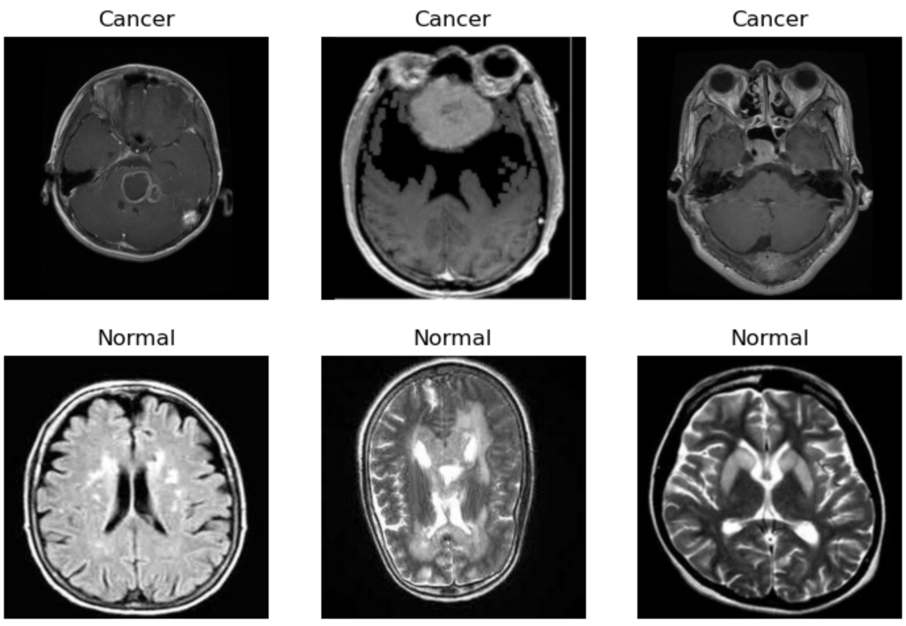

  <strong>Damien GUESDON</strong> 
  Data Scientist Junior - Computer Vision 
  CurelyticsIA 
  Mars 2026

<!-- 
[Durée estimée : 1 minute]

(Sourire, ton confiant et professionnel)
Bonjour, je suis ravi de vous présenter aujourd'hui la première phase du projet "BrainScanAI" pour la startup CurelyticsIA. 

La mission est d'assister les médecins en automatisant la détection de tumeurs cérébrales sur des IRM grâce à l'Intelligence Artificielle. 
Au-delà de la technique, il y a un défi d'envergure, un vrai défi "Business" : nous devons à terme analyser et labelliser 4 millions d'images, avec un budget extrêmement restreint de seulement 5 000 euros. 
-->

---

# 1. Le Défi Métier

#### **Le Problème :** Automatiser la détection de tumeurs sur 4 millions d'images avec un budget limité.

  
  
   
  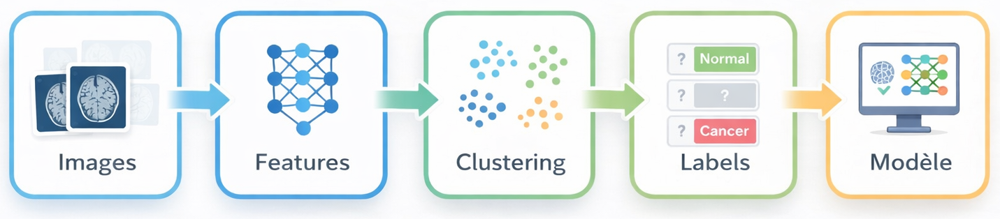

<!-- 

Pour y parvenir, j'ai appliqué un pipeline complet de Machine Learning, pour allier précision médicale et rentabilité financière.

Prétraitemetn des images, extraction des features et réduction de dimenstion, clustering (regroupement), génération d'étiquettes (weak labelling), et entrainement du modèle, pour ensuite faire la classification.

-->

---

# 2. La Répartition des Données

#### **Le Constat :** Sur 1506 images, seules 100 sont annotées, imposant une stratégie semi-supervisée.

  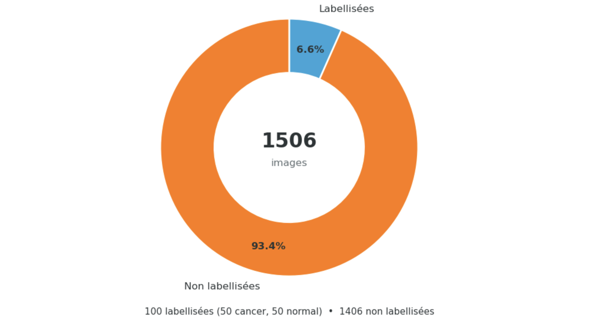

<!-- 
[Durée estimée : 1 minute]

(Ton analytique, on pose le problème)
Pour ce POC, on part d'un échantillon de 1 506 images.
Avant toute chose, j'ai appliqué un prétraitement standardisé : j'ai redimensionné les images en 224x224 et appliqué une normalisation spécifique pour qu'elles soient parfaitement prêtes pour l'analyse.

La vraie difficulté de ce projet, c'est la répartition de nos données : sur ces 1 506 images, nous n'en avons que 100 qui ont été annotées par les médecins. Les 1 406 autres n'ont aucune étiquette. 
Face à ce déséquilibre, il est impossible d'entraîner un modèle supervisé classique à grande échelle.

C'est cette contrainte forte qui nous oriente sur une stratégie "semi-supervisée".

-->

---

# 3. Extraction de Caractéristiques

#### **Zéro Entraînement :** ResNet50 transforme chaque image brute en un vecteur riche de 2048 caractéristiques.

  

<!-- 
[Durée estimée : 1 minute 15]

(Ton pédagogique, on explique un concept complexe avec des mots simples)
La toute première étape a été d'extraire des informations de ces images brutes.
Entraîner un réseau de neurones convolutif, un CNN, en partant de zéro, demande des millions d'images et une puissance de calcul colossale que nous n'avons pas. 

On doit va donc utiliser le modèle ResNet50.
C'est un modèle qui a déjà été entrainé sur des millions d'images, pour les classifier en différentes classes génériques (chien, chat, avion,...)

Notre objectif étant de différencier des cerveaux comportant des tumeurs, de cerveaux sains, on va retirer la dernière couche de classification qui ne correspond pas à notre contexte.
On ne lui demande pas de classer l'IRM, on l'utilise comme un simple extracteur visuel. 

C'est ce qu'on appelle le Transfert Learning. (utiliser l'entraineemnt existant d'un modèle pour un autre besoin)

Grâce à ça, chaque image radiographique a été transformée en un vecteur mathématique dense de 2 048 dimensions, qui résume parfaitement ses textures, ses contrastes et ses formes.

**Expliquer Comment CNN marche.
Si je dois résumer, un CNN est un réseau de neurones qui applique une série de filtres glissants sur l'image pour y repérer des contrastes, puis des textures de plus en plus complexes. Ici on récupére le résultat mathématique de cette observation visuelle à la sortie de ses filtres : un vecteur de 2 048 dimensions qui résume parfaitement l'IRM.

** Réseau de Neurones
Un réseau de neurones est un modèle mathématique, inspiré du fonctionnement du cerveau humain, qui fait passer l'information à travers des dizaines de couches de calculs successives pour apprendre, par l'exemple, à reconnaître des schémas complexes dans les données. Ici Resnet50 a 50 couches successives.
on apprend des erreurs avec la retropropagation de gradient. Chaque neurone a un poids (une valeur + une formule d'activation)
-->

---

# 4. L'absence de groupes denses évidents

#### **Information diffuse :** La PCA révèle une variance répartie sans variable dominante, et l'algorithme DBSCAN ne détecte que du bruit, confirmant l'absence de densité locale.

  

    <h3>Cercle des Corrélations</h3>
    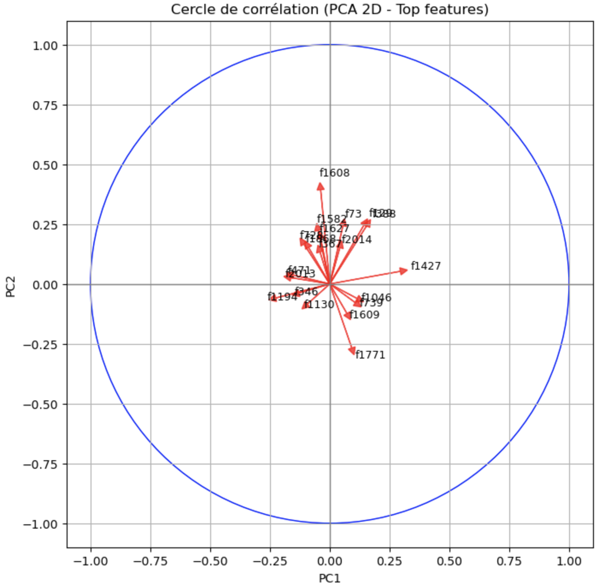
  

  

    <h3>Clustering DBSCAN (100% Bruit)</h3>
    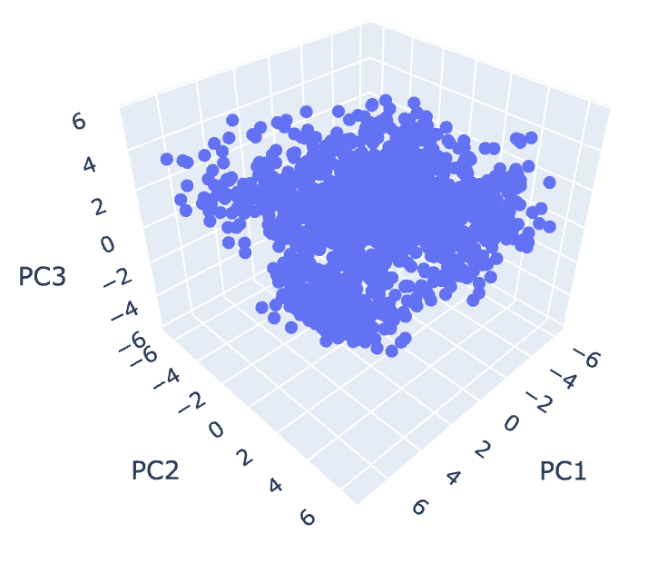
  

<!-- 
[Durée estimée : 1 minute 30]

(Ton explicatif pour anticiper la question du mentor sur DBSCAN et la PCA)
Cependant, travailler sur 2 048 dimensions, c'est trop lourd, trop bruité.
On applique donc une PCA, une Analyse en Composantes Principales, pour compresser ces données à 50 dimensions, tout en conservant l'information mathématique utile.

** Expliquer PCA

On voit sur le cercle des corrélations généré par la PCA que l'information est très diffuse. Les flèches pointent dans toutes les directions. Il n'y a pas de variable dominante. 
C'est ce qui explique parfaitement pourquoi l'algorithme de clustering DBSCAN testé a échoué juste après.
DBSCAN est conçu pour chercher des « nuages de points denses ».

Ici, l'information visuelle étant extrêmement diffuse, DBSCAN n'a trouvé aucun groupe et a classé 100% de nos images comme du "bruit" !
Son score ARI a d'ailleurs été impossible à calculer. Il a donc fallu changer d'approche.

Cercle de corrélation : On obtient le cercle de corrélation en réalisant une Analyse en Composantes Principales (PCA) projetée sur deux dimensions afin de visualiser la contribution des variables d'origine aux deux axes principaux
.
DBSCAN : L'algorithme DBSCAN effectue son regroupement en recherchant des zones présentant une forte densité locale (des nuages de points très rapprochés), et classe les points isolés restants comme du bruit (ça marche par proximité)

-->

---

# 5. Le choix du nombre de clusters (K)

#### **Évaluation des métriques :** L'inertie et la silhouette orientent vers K=2, tandis que le **dendrogramme** confirme l'existence de regroupements naturels.

  
  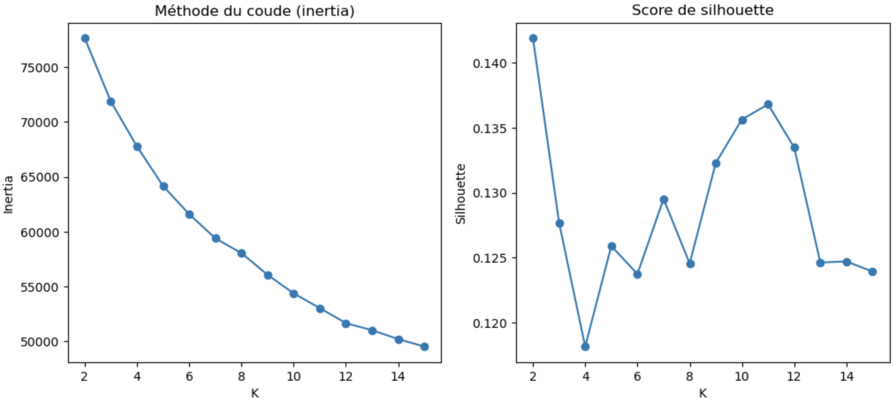
    
  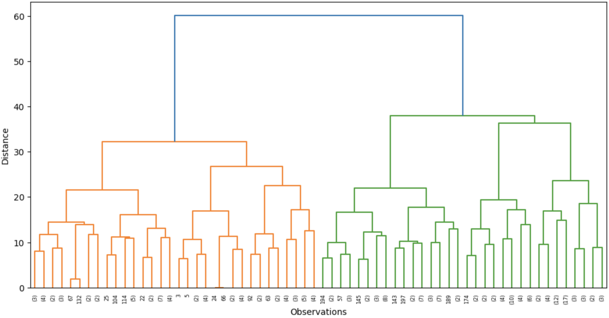

<!-- 
[Durée estimée : 1 minute 15]

(Ton enthousiaste, on a trouvé une solution)
Je me suis donc tourné vers d'autres algorithmes. J'ai d'abord généré un dendrogramme via un clustering hiérarchique. Ce dernier a l'avantage de relier les images par similarité (par paires), et il m'a confirmé visuellement que des regroupements naturels existaient bien dans nos données.

Ici plus les branches verticales sont hautes, plus les différences sont élevées, donc plus il y a un écart vertical important, plus les groupes sont marqués.

Je suis ensuite passé sur un algorithme KMeans. Il fallait choisir le bon nombre de groupes, qu'on appelle K.

Il y a plusieurs méthodes pour le définir.
Par exemple la méthode du coude, où là on n'observe pas vraiment d'irrégularité,
Et le Score de Silhouette pour différentes valeurs (de 2 à 15), où le score était maximal pour K=2, on voit également des pics potentiellement intéressants pour k=10 ou k=11. 

Comme les chiffres convergent vers k=2 et que ça répond à notre logique métier (cerveau sain vs malade), je m'oriente vers cette option.

La méthode du coude : Elle consiste à tracer la courbe de l'inertie (c'est-à-dire la dispersion des points au sein de leurs groupes) en fonction du nombre de clusters (K), et à choisir l'endroit où la courbe se casse nettement (le fameux "coude"), ce qui indique mathématiquement qu'ajouter davantage de groupes n'améliore plus vraiment la séparation des données
.
Le score de Silhouette : Il évalue la qualité de ces groupes en mesurant si chaque image est très proche des membres de sa propre famille et, à l'inverse, bien éloignée des familles voisines

-->

---

# 6. L'organisation non supervisée

#### **Séparation métier :** Le KMeans (K=2) offre le regroupement binaire (Cancer vs Normal) le plus pertinent.

  

    <h3>K = 2</h3>
    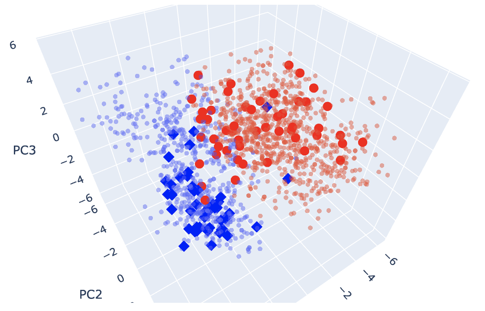
  

  

    <h3>K = 10</h3>
    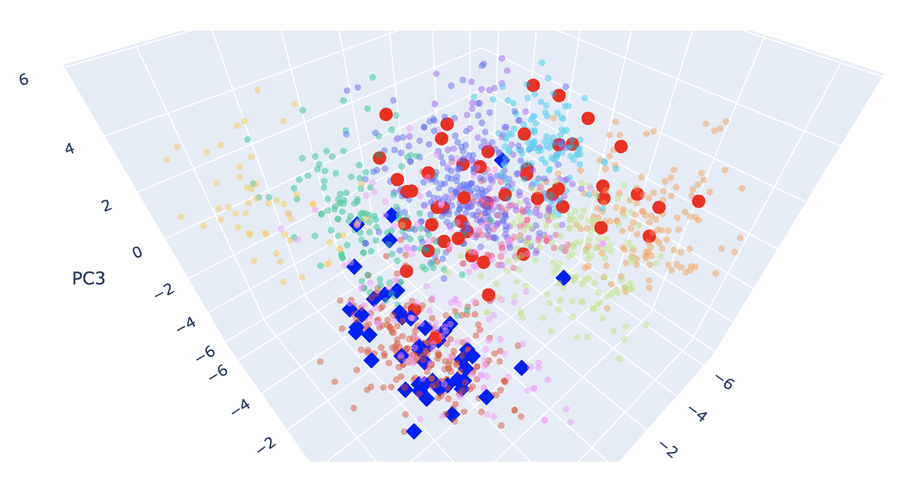
  

  

    <h3>K = 11</h3>
    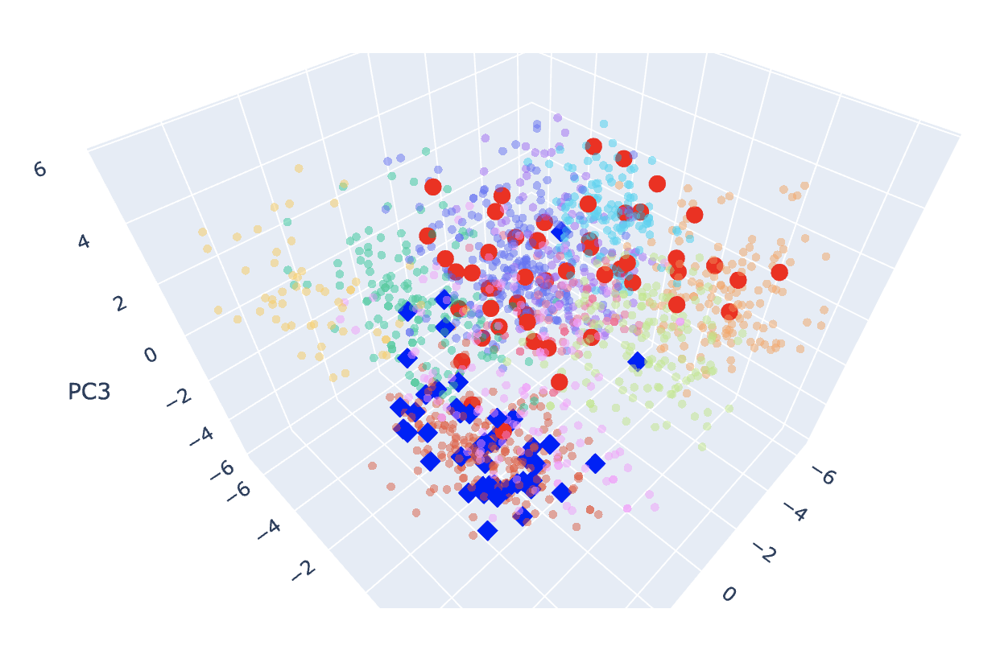
  

<!-- 
[Durée estimée : 1 minute]

(Ton de la preuve scientifique)
Voici la modélisation en 3D de notre algorithme KMeans avec K=2. On voit que les deux groupes se dégagent.
Mais comme le modèle a fait ses regroupements à l'aveugle, il faut en vérifier mathématiquement la correspondance.

Pour le vérifier, j'ai calculé le score ARI (Adjusted Rand Index). C'est une métrique qui compare les groupes déterminés par le modèle, avec les 100 vrais labels des médecins.
Un score ARI de 0 équivaut à un regroupement fait totalement au hasard. Notre modèle a obtenu 0.485.

Cela prouve de manière irréfutable que l'algorithme a trouvé une séparation logique et pertinente, bien au-dessus de la chance, justifiant la suite du projet !

Le KMeans : L'algorithme place initialement de manière aléatoire un nombre défini de centres de gravité (ici K=2) dans l'espace de vos données, puis rattache chaque image au centre le plus proche en réajustant la position de ces centres en boucle jusqu'à obtenir des groupes géométriquement stables
.
Le score ARI : La formule simplifiée consiste à calculer le taux de correspondance exact entre les groupes créés par la machine et les vraies étiquettes de vos médecins, puis à lui soustraire mathématiquement le score de réussite qu'aurait obtenu un regroupement fait totalement au hasard

-->

---

# 7. Stratégie du "Weak Labeling"

#### **Aucune fuite de données :** Une séparation stricte Train/Test permet d'associer logiquement un label au cluster.

  
Cluster 0 (Label Normal)

  
Cluster 1 (Label Cancer)

  

    
✔<strong>Images totales :</strong> 675

    
<strong>Taux de confiance :</strong> 75%

  

  

    
✔<strong>Images totales :</strong> 831

    
<strong>Taux de confiance :</strong> 94%

  

<!-- 
[Durée estimée : 1 minute 30]

(Ton sérieux, on parle de la rigueur de la méthode)
C'est ici que commence le cœur de l'approche semi-supervisée : le "Weak Labeling", ou l'étiquetage faible. 
L'objectif est d'associer nos 1 406 images non labellisées à leur groupe (Cancer ou Normal), tout en évitant le piège du Data Leakage, la fuite de données ! 

J'ai splitté les données en 2 groupes, un premier pour l'entraînement, et un second qui ne sera utilisé que pour le test final, pour l'évaluation des résultats. Le modèle ne les a jamais vues.

Compte tenu du faible volume, j'ai opté pour 50% des données, pour avoir sufisament d'infos et pour l'entrainement et pour le test (donc 25 images saines, 25 images avec cancer pour chacun des deux jeu (train et test)), 

En regardant uniquement nos 50 données d'entraînement, il ressort que le Cluster 1 contient 94% de cancers. C'est donc cette étiquette (Weak Label) qui sera attribuée à toutes les images qui tombent dans ce cluster.
-->

---

# 8. Filtrage des Labels Faibles

#### **Exigence de fiabilité :** Seules les images avec une confiance au cluster très élevée sont retenues.

  

    
🗂️

    
1 406

    
Images brutes non labellisées attribuées à un cluster.

  

  

    
🎯

    
Seuil > 80%

    
Application stricte d'un filtre de confiance algorithmique.

  

  

    
✅

    
792

    
"Labels Faibles" fiables et retenus pour l'entraînement.

  

<!-- 
[Durée estimée : 1 minute]

(Montrer de l'esprit critique)
Cependant, pour le cluster « Normal », le modèle n'était sûr qu'à 75% (seuls 75% des images étaient des radios de cerveaux sains). 
Si j'avais donné ces 1 406 images brutes directement à la machine pour s'entraîner, elle aurait appris sur beaucoup d'erreurs potentielles, ce qui aurait généré du bruit et dégradé le modèle.

J'ai donc appliqué un filtre algorithmique très strict, pour ne garder que les images avec plus de 80% de confiance au sein de leur cluster.
Résultat : sur les 1 406 images, nous n'en avons conservé que 792. Ce sont 792 images extrêmement fiables qui ont enrichi notre jeu d'entraînement.

On calcule la proportion de la classe majoritaire parmi nos quelques données labellisées d'entraînement au sein de chaque cluster, et on ne conserve pour la suite de l'apprentissage que les images appartenant à un groupe dont cette "pureté" statistique atteint au moins 80%
-->

---

# 9. Le Choix de la Métrique

#### **Enjeu médical vital :** Ne rater aucune tumeur (Faux Négatif). La métrique reine est donc le Recall (Rappel).

  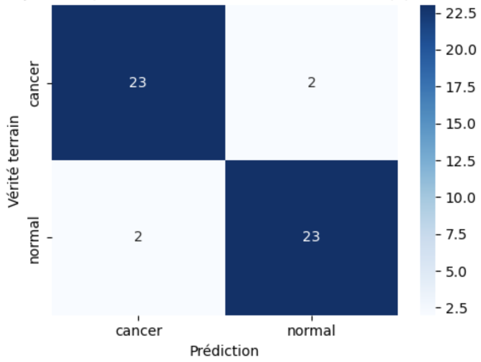

<!-- 
[Durée estimée : 1 minute]

(Ton plus grave et insistant, on parle de vie humaine)
Avant de regarder les résultats de notre modèle, il faut définir notre "juge de paix". Quelle métrique regarder ? 
En médecine, "l'Accuracy" (le pourcentage global de bonnes réponses) est un piège. 

Notre enjeu vital, c'est de ne rater aucune tumeur. On préfère largement déclencher une fausse alerte et faire des examens supplémentaires, plutôt que de renvoyer un patient chez lui avec une tumeur non détectée : c'est ce qu'on appelle un Faux Négatif, et c'est dramatique. 
La métrique reine absolue que j'ai choisi de surveiller et d'optimiser, c'est donc le Recall, le Rappel en français, qui mesure notre capacité à détecter tous les vrais malades.

** Expliquer la matrice de confusion
-->

---

# 10. Supervisé VS Semi-Supervisé

#### **Évaluation des performances :** L'ajout brut de données dégrade le Recall, prouvant la nécessité du filtre pour dépasser la baseline.

  

    
Supervisé Pur (Baseline)

    

      
<strong>Accuracy globale :</strong> 0.90

      
<strong>F1-Macro :</strong> 0.90

      
<strong>Recall (Cancer) :</strong> 0.92

    

  

  

    
Semi-Sup. Brut (+ 1406 labels)

    

      
<strong>Accuracy globale :</strong> 0.88

      
<strong>F1-Macro :</strong> 0.88

      
<strong>Recall (Cancer) : 0.80 ⚠️</strong>

    

  

  

    
Semi-Sup. Filtré (+ 792 labels)

    

      
<strong>Accuracy globale :</strong> 0.92

      
<strong>F1-Macro :</strong> 0.92

      
<strong>Recall (Cancer) : 0.92 ✅</strong>

    

  

<!-- 
[Durée estimée : 1 minute 15]

(Ton dynamique, c'est l'heure du bilan technique)
Voici les résultats finaux, validés sur notre jeu de test qui est resté totalement imperméable. 

Notre "modèle supervisé pur", qui est notre point de départ entraîné uniquement sur 50 images, avait un Recall de 0.92. 
Avec les 1 406 labels faibles sans les filtrer, le modèle apprend sur du bruit, et le Recall s'effondre à 0.80. Autrement dit, le modèle est moins efficace que le supervisé et rate des cancers !
Grâce à notre "Weak Labeling filtré", le modèle semi-supervisé cible a fait remonter la précision (l'Accuracy) globale, tout en maintenant le Recall maximal à 0.92. La stratégie de filtrage est donc un succès total.
On est aussi pertinents que le supervisé pur sur le recall, et en plus on gagne en précision (moins de fausses alertes)
-->

---

# 11. Analyse des Incertitudes

#### **Active Learning :** La prédiction cible précisément les cas "ambigus" nécessitant l'expertise du radiologue.

  
  

    

      
🤖 ➡️ 🧑‍⚕️

      
Score de confiance ~ 50%

      
Au lieu de tout labelliser, le modèle isole uniquement les cas où il "hésite" pour les envoyer à un expert.

    

  

  

    

      <h3>Extrait des prédictions</h3>
      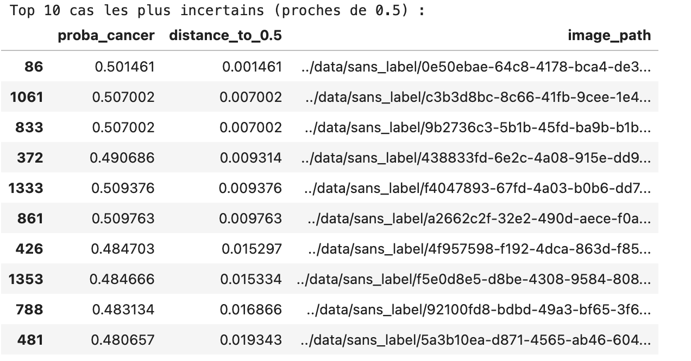
    

  

<!-- 
[Durée estimée : 1 minute]

(Ton complice, on dévoile l'astuce pour la suite)
On va maintenant s'appuyer sur l'analyse des probabilités pour améliorer l'ensemble. 
Le modèle ne se contente pas de dire simplement « Cancer » ou « Normal ». Il dit par exemple « C'est un cancern et j'en suis sûr à 99% ». 

Ce pourcentage de certitude est les predict proba.

Comme vous le voyez sur ce tableau extrait de mes tests, la machine est capable d'isoler mathématiquement les cas où elle « hésite » fortement, c'est-à-dire quand la probabilité tourne autour de 50%. Ce concept, c'est ce qu'on appelle l'Active Learning (l'Apprentissage Actif). Et c'est exactement la réponse budgétaire pour notre passage à l'échelle.

** Expliquer comment on calcule le predict proba.

Y a un truc avec la courbe sigmoïde, mais je ne sasi plus exactement commetn ça marche. 
-->

---

# 12. Passage à l'échelle & Recommandations

#### **Optimisation Budget :** Les 5 000€ seront exclusivement dédiés à la labellisation par les experts des 10% de cas incertains.

 

  
⚡

  
<strong>Automatisation :</strong> La pipeline attribue automatiquement un label à ~90% des 4 Millions d'images.

  
🩺

  
<strong>Focalisation :</strong> Les probabilités proches de 0.5 déclenchent l'expertise humaine, divisant radicalement les coûts d'annotation.

<!-- 
[Durée estimée : 1 minute 30]

(Ton "Chef de Projet", très convaincant, on termine en beauté)
C'est grâce à ça qu'on va pouvoir traiter 4 millions d'images avec seulement 5 000 euros ?

L'annotation humaine a coûté 300 euros pour nos 100 premières images, soit 3 euros par image. Avec un budget de 5 000 euros, et en conservant ce barème, on peut donc payer des médecins pour relire 1 666 images (4998€). 
On est encore loin des 4 millions.

Mais on peut procéder ainsi :
Notre modèle semi-supervisé va d'abord auto-labelliser "quasi gratuitement" les 4 millions d'images (je ne compte pas les coûts électrique d'exploiration des serveurs et de calcul, car on n'a pas l'information dans la mission, je suppose donc que ça ne fait pas partie de l'équation).
Ensuite, l'algorithme va extraire de cette masse gigantesque *précisément* les 1 666 cas les plus incertains (ceux proches de 50%).
Nous sanctuariserons donc les 5 000 euros pour faire trancher uniquement ces 1 666 cas très difficiles par des experts, puis nous ré-entraînerons le modèle avec ce nouveau savoir humain, ce qui devrait améliorer significativement les résultats, et on relabellise l'ensemble avec ce modèle réentrainé.
C'est ce qu'on appelle l'Active Learning (on cible sur quelles données on réentraine le modèle, au lieu de le faire en full automatique).

-->

---

  

  <h3 style="text-transform:none; color:var(--color-primary); margin:0;">
    Preuve de concept validée : l'intégration d'une boucle semi-supervisée stricte fiabilise et massifie les données tout en respectant l'enveloppe budgétaire.
  </h3>

  
  
CurelyticsIA - Innovation e-Santé

<!-- 
Grâce à cette boucle d'Active Learning, nous obtenons une IA performante à l'échelle industrielle, sans perte de qualité médicale, et tout en respectant notre enveloppe budgétaire au centime près ! 

Je vous remercie de votre attention et je suis à votre disposition pour vos questions !
-->
